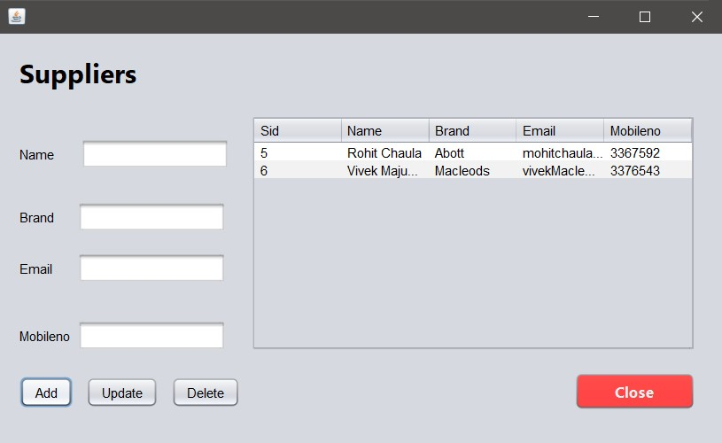

# Management System using Java Swing and MySQL Database Server.

## Overview

This project is a Java Swing-based Pharmacy Management System (Medimart) integrated with a MySQL database. It offers a user-friendly interface built using Swing components for easy navigation and data management. The system allows users to perform various management tasks such as adding, editing, and deleting records of medicines, patients, suppliers, purchases and sales stored in a MySQL database.

## Features

- **User-friendly Interface**: The system provides a clean and intuitive user interface built with Java Swing.
- **MySQL Integration**: Utilizes MySQL database for storing and managing data.
- **CRUD Operations**: Supports basic CRUD (Create, Read, Update, Delete) operations for managing records.
- **Search Functionality**: Allows users to search for specific records within the database.
- **Error Handling**: Implements error handling to provide informative messages in case of any issues.
- **Easy Setup**: Can be set up easily using NetBeans IDE.

## Requirements

- Java Development Kit (JDK)
- NetBeans IDE
- MySQL Database Server

## Setup Instructions

1. **Clone the Repository**: Clone or download the project repository to your local machine.

2. **Import Project into NetBeans**:
   - Open NetBeans IDE.
   - Select `File` > `Open Project`.
   - Navigate to the location where you cloned the repository and select the project folder.

3. **Configure MySQL Database**:
   - Make sure you have MySQL installed and running on your system.
   - Create a new database for the management system.
   - Import the provided SQL schema to create necessary tables and populate initial data.

4. **Update Database Configuration**:
   - Open the project in NetBeans.
   - Locate the database configuration file (`config.properties` or similar).
   - Update the database connection details such as host, port, username, and password according to your MySQL setup.

5. **Build and Run**:
   - Once the configuration is updated, build the project.
   - Run the project to launch the management system.

## Medimart - Pharmacy Management System

This system consists of the following pages.
- **Home** - Upon launching the application, you will be presented with the home interface where you can navigate to different pages.
- **Items** - Perform CRUD operations on records of medicinal items storing their name, category, composition, quantity and price.
- **Supplier** - Perform CRUD operations on records of supplier details storing their name, email, brand and phone number.
- **Patient Details** - Upload prescription and store details of patients like name, email and phone number for delivery purposes.
- **Purchases** - Storing information of purchased medicinal items from suppliers and ensure to confirm so that the purchases get updated in the items page.
- **Sales** - Storing information of sold medicinal items to patients and ensure to confirm so that the sales get updated in the items page.

## Home interface

## Items interface

## Supplier interface

## Patient Details interface

## Purchases interface

## Sales interface

## License

This project is licensed under the [MIT License](LICENSE).

🚀 Happy coding! 🛠️
